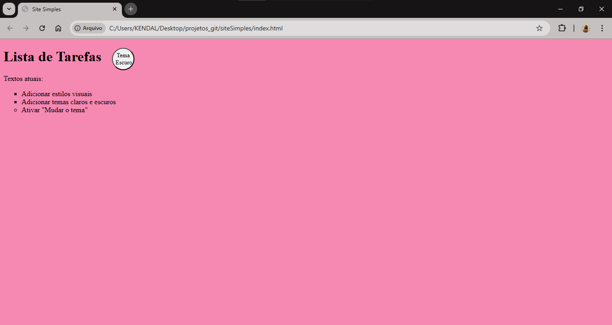

# 🌟 Site Simples  

Bem-vindo(a) ao **Site Simples**! Este é o meu primeiro projeto, onde explorei conceitos básicos de HTML, CSS e JavaScript para criar um site com alternância de temas claro e escuro.  

## 📖 Sobre o Projeto  
O site permite que os usuários alternem entre os temas **Claro** e **Escuro** de forma dinâmica, utilizando JavaScript e variáveis CSS.  

- **Tema Claro**: Fundo rosa com texto em preto.  
- **Tema Escuro**: Fundo preto com texto em rosa.  
- O botão é branco, redondo, e ao ser clicado, alterna entre os temas.  

---

## 🚀 Tecnologias Utilizadas  
- **HTML5** 🖋️  
- **CSS3** 🎨  
- **JavaScript** 💻  

---

## ⚙️ Funcionalidades  
- Alternância de temas entre **Claro** e **Escuro**.  
- Estilização dinâmica com variáveis CSS.  
- Botão interativo que alterna entre os temas.  

---

## 🛠️ Como Executar o Projeto  

1. Clone este repositório:  
   ```bash
   git clone https://github.com/Kendal-Katherine/siteSimples.git
   ```
2. Navegue até o diretório:  
   ```bash
   cd siteSimples
   ```
3. Abra o arquivo `index.html` em seu navegador favorito:  
   - Clique duas vezes no arquivo **index.html** ou  
   - Use o terminal:  
     ```bash
     start index.html   # Windows  
     open index.html    # macOS  
     xdg-open index.html # Linux  
     ```  

---

## 📂 Estrutura do Projeto  
```
siteSimples/
├── images/        # Pasta para capturas de tela 
├── app.js         # Lógica de alternância de temas
├── index.html     # Estrutura do site
├── main.css       # Estilização com variáveis CSS
└── README.md      # Documentação do projeto
```  

---

## 🎉 Demonstração  
### Tema Claro  
  

### Tema Escuro  
  

---

## 🤝 Contribuições  
Sinta-se à vontade para fazer melhorias ou utilizar este projeto como base para o seu aprendizado!  

---

## 📝 Licença  
Este projeto é open-source e está sob a licença [MIT](LICENSE).  

---

O link do seu repositório está agora visível! Se precisar de mais alguma coisa, é só avisar! 😊
